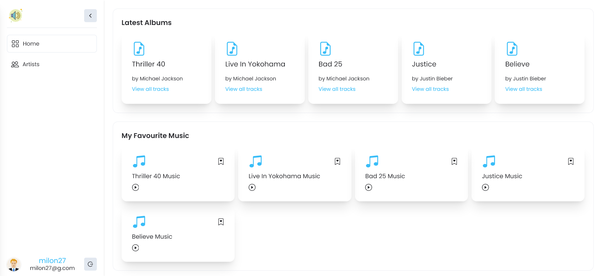

# How To Run

### First clone this repo.

## Process 1 (using bash)

```bash
# run server first
bash server.sh

# run client after server in separate terminal
bash client.sh

# all done. if you want you can also run without bash script by following below's instruction.
```

## Process 2 (manully)

- **Run postgresql container**
```bash
docker compose up -d
```
- **Make sure you have pnpm**
```bash
npm i -g pnpm
```

- **Run server**
```bash
# intall deps
cd server && pnpm install

# apply prisma migration in production  (run on server directory)
npm run p-mg-prod

# generate prisma client (run on server directory)
npm run p-gen

# seed database (run on server directory)
npm run seed

# run the server (run on server directory)
npm run dev
```

- **Run Client**
```bash
# intall deps
cd client && pnpm install

# (run on client directory)
npm run dev
```


## screenshot




by [milon27](https://milon27.com/)